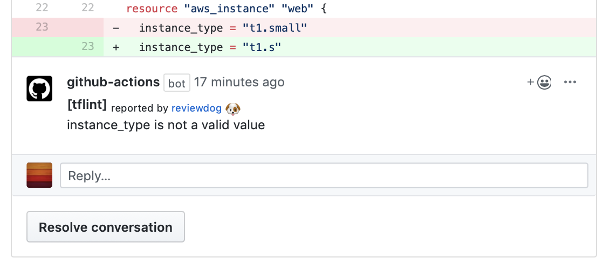

# GitHub Action: Run tflint with reviewdog

This action runs [tflint](https://github.com/wata727/tflint) with
[reviewdog](https://github.com/reviewdog/reviewdog) on pull requests
to enforce best practices.

## Examples

### With `github-pr-review`

By default, with `reporter: github-pr-review` a comment is added to
the Pull Request Conversation:



### With `github-pr-check`

With `reporter: github-pr-check` an annotation is added to
the line:


## Inputs

### `github_token`

**Required**. Must be in form of `github_token: ${{ secrets.github_token }}`.

### `level`

Optional. Report level for reviewdog [info,warning,error].
It's same as `-level` flag of reviewdog.

### `reporter`

Reporter of reviewdog command [github-pr-check,github-pr-review].
Default is github-pr-check.
github-pr-review can use Markdown and add a link to rule page in reviewdog reports.

### `flags`

Optional. List of arguments to send to tflint.
For the output to be parsable by reviewdog [`--format=checkstyle` is enforced](./entrypoint.sh).
The default is `--module`.

## Example usage

```yml
name: reviewdog
on: [pull_request]
jobs:
  tflint:
    name: runner / tflint
    runs-on: ubuntu-latest

    steps:
      - name: Clone repo
        uses: actions/checkout@master
        with:
          fetch-depth: 1

      # Install latest Terraform manually as
      #  Docker-based GitHub Actions are
      #  slow due to lack of caching
      - name: Install Terraform
        run: |
          curl -LO https://raw.github.com/robertpeteuil/terraform-installer/master/terraform-install.sh
          chmod +x terraform-install.sh
          ./terraform-install.sh -a

      - name: Terraform init
        run: |
          terraform init

      - name: tflint
        uses: reviewdog/action-tflint@master
        with:
          github_token: ${{ secrets.github_token }}
          reporter: github-pr-review # Change reporter
          flags: "--deep" # Optional
```
