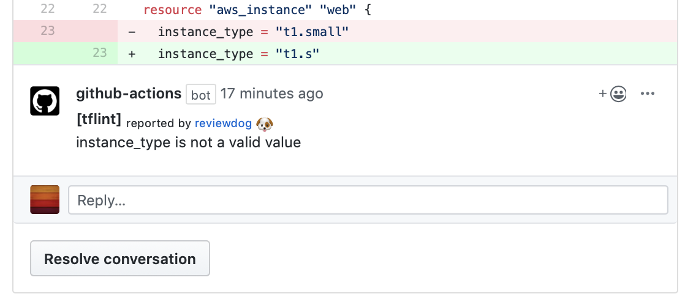

# GitHub Action: Run tflint with reviewdog

This action runs [tflint](https://github.com/wata727/tflint) with
[reviewdog](https://github.com/reviewdog/reviewdog) on pull requests
to enforce best practices.



## Inputs

### `github_token`

**Required**. Must be in form of `github_token: ${{ secrets.github_token }}`.

### `level`

Optional. Report level for reviewdog [info,warning,error].
It's same as `-level` flag of reviewdog.

### `args`

Optional. List of arguments to send to tflint.
The default is `--module --format=checkstyle`.

## Example usage

```yml
name: reviewdog
on: [pull_request]
jobs:
  tflint:
    name: runner / tflint
    runs-on: ubuntu-latest

    steps:
      - name: Clone repo
        uses: actions/checkout@master
        with:
          fetch-depth: 1

      # Install latest Terraform manually as
      #  Docker-based GitHub Actions are
      #  slow due to lack of caching
      - name: Install Terraform
        run: |
          curl -LO https://raw.github.com/robertpeteuil/terraform-installer/master/terraform-install.sh
          chmod +x terraform-install.sh
          ./terraform-install.sh -a

      - name: Terraform init
        run: |
          terraform init

      - name: tflint
        uses: reviewdog/action-tflint@master
        with:
          GITHUB_TOKEN: ${{ secrets.GITHUB_TOKEN }}
```
